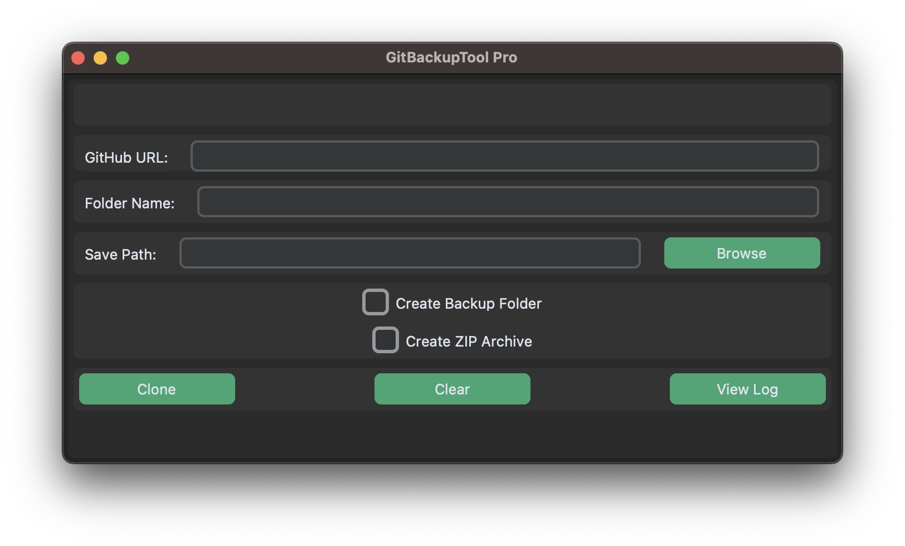

# GitBackupTool Pro

<div align="center">


**A modern, user-friendly Git repository backup tool with native GUI**

[Features](#-features) • [Installation](#-installation) • [Usage](#-usage) • [Documentation](#-documentation) • [Contributing](#-contributing)

</div>

---

## 🎯 Overview

GitBackupTool Pro streamlines GitHub repository management with an intuitive, native GUI built on PySide6. Clone repositories, create timestamped backups and generate ZIP archives. All through a modern, responsive interface that prevents UI freezing during operations.

### Key Highlights

- **Modern UI/UX**: Dark theme with rounded corners, hover effects, and smooth animations
- **Non-blocking Operations**: Threaded git operations keep the interface responsive
- **Smart Validation**: Real-time URL validation before cloning
- **Auto-save**: Remembers your last used repository and save path
- **Comprehensive Logging**: Detailed logs for troubleshooting and audit trails

---

## ✨ Features

### Core Functionality
- Clone GitHub repositories with progress feedback
- Create timestamped backup folders
- Generate ZIP archives automatically
- Detailed logging of all operations
- Persistent configuration storage

### User Experience
- Native dark theme with modern design
- Responsive UI with threaded operations
- Focus states and hover effects for accessibility
- Animated status notifications
- Keyboard-friendly interface

---

## 📦 Installation

### Prerequisites

Ensure the following are installed on your system:

- **Git** 2.30+ ([Download](https://git-scm.com))
- **Python** 3.9+ ([Download](https://www.python.org))

### Quick Start

1. **Clone the repository**
   ```
   git clone https://github.com/beri336/GitBackupTool-Pro.git
   cd GitBackupTool-Pro
   ```

2. **Install dependencies**
   ```
   pip install -r requirements.txt
   ```

3. **Run the application**
   ```
   python3 main.py
   ```

### Alternative: Virtual Environment (Recommended)

```
python3 -m venv .venv
source .venv/bin/activate             # On Windows: .venv\Scripts\activate
pip3 install -r requirements.txt
python3 main.py
```

---

## 🚀 Usage

### Basic Workflow

1. **Launch the application**
   ```
   python -m src.main
   ```

2. **Enter repository details**
   - **GitHub URL**: Full repository URL (e.g., `https://github.com/user/repo`)
   - **Folder Name**: Local directory name for the clone
   - **Save Path**: Target directory (use Browse button for selection)

3. **Configure options** (optional)
   - **Create timestamped backup folder**: Adds `_backup_YYYYMMDD_HHMMSS` suffix
   - **Create ZIP archive**: Generates compressed archive after cloning

4. **Click "Clone Repository"** and monitor the status notification



### UI Components

| Component | Description |
|-----------|-------------|
| **GitHub URL** | Repository URL to clone (validates on submit) |
| **Folder Name** | Name for the local directory |
| **Save Path** | Destination directory with browse dialog |
| **Browse** | Opens native folder picker |
| **Clone Repository** | Starts the cloning process |
| **Clear All** | Resets all input fields |
| **View Log** | Opens `log.txt` in default editor |
| **Backup Checkbox** | Enables timestamped folder naming |
| **ZIP Checkbox** | Creates archive post-clone |

---

## 📚 Documentation

### Configuration Files

- **`last_used_repo.json`**: Stores last repository URL and save path
- **`log.txt`**: Timestamped operation logs

### API Reference

#### Core Functions

##### `CloneWorker.run()`
Executes git clone in a separate thread to prevent UI blocking.

**Parameters:**
- `github_url` (str): Repository URL
- `folder_name` (str): Target folder name
- `target_path` (str): Destination directory
- `add_backup` (bool): Enable timestamped naming
- `create_zip` (bool): Generate ZIP archive

**Signals:**
- `finished(bool, str)`: Emits success status and message

##### `is_valid_repo_url(url: str) -> bool`
Validates repository accessibility via `git ls-remote`.

**Returns:** `True` if repository is reachable, `False` otherwise

---

## 🐛 Troubleshooting

### Common Issues

#### Clone Fails with "Invalid URL"
**Solution:**
- Verify URL format: `https://github.com/username/repository`
- Check repository visibility (public/private access)
- Test manually: `git ls-remote <url>`

#### UI Freezes During Clone
**Solution:**
- This shouldn't happen with v2.0+. If it does, check Python version (3.9+ required)
- Verify PySide6 installation: `pip show PySide6`

#### ZIP Archive Not Created
**Solution:**
- Ensure successful clone completion first
- Verify write permissions in target directory
- Check `log.txt` for detailed error messages

#### "Log File Not Found"
**Solution:**
- Perform at least one operation to generate logs
- Log file is created in the application directory

### Debug Mode

Enable verbose logging by setting the environment variable:
```
export GITBACKUP_DEBUG=1  # Linux/macOS
set GITBACKUP_DEBUG=1     # Windows
python3 main.py
```

---

## 🤝 Contributing


---

## 📝 Changelog

### Version 2.0.0
**BREAKING CHANGES**
- 🎨 Migrated from CustomTkinter to PySide6 for native performance
- ♻️ Complete UI/UX redesign with modern dark theme
- ⚡ Implemented threaded operations for responsive UI
- ✨ Added animated status notifications
- 🎯 Improved accessibility with focus states

### Version 1.0.0 (Initial Release)
- Core cloning functionality
- Backup folder creation
- ZIP archive generation
- Basic logging system
- CustomTkinter GUI

---

<div align="center">

**Made by [beri336](https://github.com/beri336)**

[Report Bug](https://github.com/beri336/GitBackupTool-Pro/issues) • [Request Feature](https://github.com/beri336/GitBackupTool-Pro/issues)

</div>
