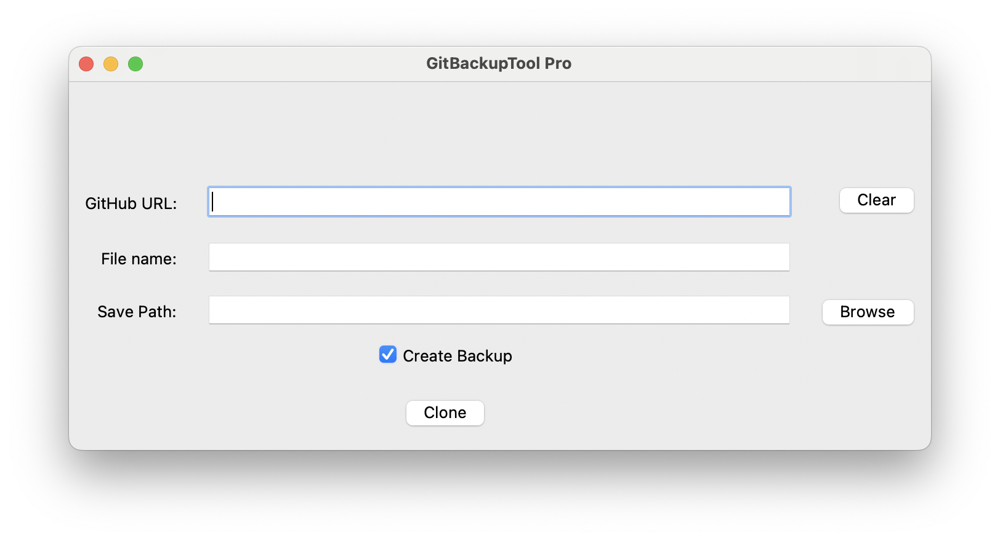
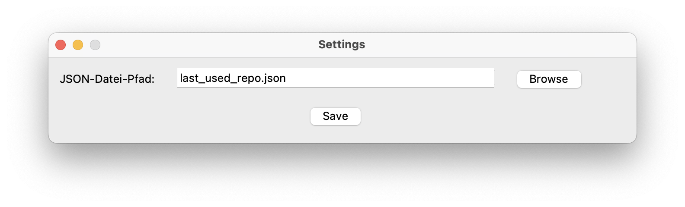
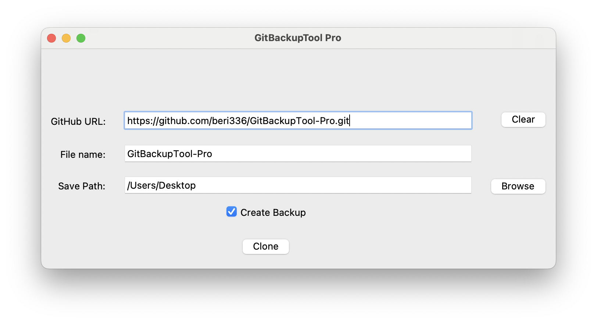

# README GitBackupTool-Pro

## Table of Contents

1. [Motivation](#motivation)
2. [Installation](#installation)
3. [Usage](#usage)
4. [Example](#example)
4. [Release](#release)

<br>
<hr>

### Motivation
- this project is designed to clone GitHub Repositories faster and more efficiently
- you can create quick backups to have a backup in case of problems with your GitHub Repositories
- you can also quickly clone several Repositories, to make this faster

<br>
<hr>

### Installation
- download this GitHub Repository with the command `git clone https://github.com/beri336/GitBackupTool-Pro.git`
- then open the program in any IDE and run it
- or create an executable app, depending on the operating system

<br>

> Create an executable on Mac

- install py2app `pip install py2app`
- create `setup.py` and copy this in:
```Python
from setuptools import setup

APP = ['main.py']
OPTIONS = {'argv_emulation': True}

setup(
    app=APP,
    options={'py2app': OPTIONS},
    setup_requires=['py2app'],
)
```
- create the executable file `python setup.py py2app`

<br>
<hr>

> Create an executable on Windows
- install pyinstaller `pip install pyinstaller`
- create the executable file `pyinstaller --onefile main.py`

<br>
<hr>

> Create an executable on Linux
- install pyinstaller `pip install pyinstaller`
- create the executable file `pyinstaller --onefile main.py`

<br>
<hr>

### Usage
- to clone a repository, paste the GitHub Repository URL into the corresponding text field
- name the folder that will be created by downloading the GitHub Repository in
- click on `browse` or enter the path for the folder yourself
- click on `clone` to start the process
- the `clean` button removes all entries in the text field
- you will receive a success message if the Repository has been loaded, or otherwise the error message
- in the `Settings` tab, the previous GitHub Repository is loaded (if available) and the path can be customized here
    - you can also use the shortcut to open the settings
        - Mac: `Command + ,`
        - Windows/ Linux: `Control + ,`
- if you activate `Create Backup` checkbox, the file name will be `{your_folder_name}_backup_{current_date}_{current_time}`
    - if not, then only `{your_folder_name}`

<div style="text-align:center;">
  
</div>

<div style="text-align:center;">
  
</div>

<br>
<hr>

### Example
- here is an example of how the program can be used

<div style="text-align:center;">
  
</div>

<br>
<hr>

### Release

> V1.0
- Cloning GitHub Repository with a GUI