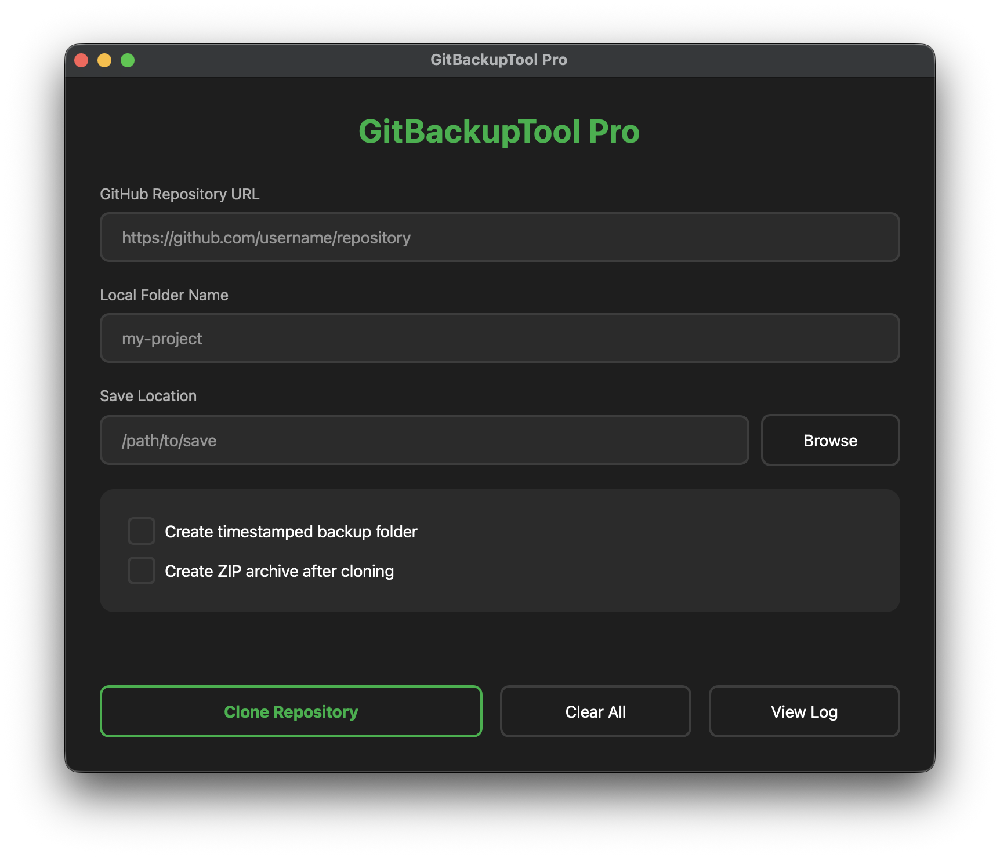

<!-- README.md -->

<div align="center">

# GitBackupTool Pro


[Features](#features) • [Installation](#installation) • [Usage](#usage) • [Architecture](#architecture) • [Configuration Files](#configuration-files) • [Documentation](#documentation) • [Me](#me) • [License](#license)



</div>

<hr>

## What is GitBackupTool Pro?

GitBackupTool Pro is a **desktop application** that simplifies backing up your GitHub repositories. Clone repositories, create timestamped backups and generate ZIP archives with a graphical interface.

<hr>

<div align="center">

## Features

### **Modern User Interface**

</div>

- Dark theme with green accent colors
- Real-time status notifications with auto-hide
- Native file picker dialog

<div align="center">

### **Core Functionality**

</div>

- Clone GitHub, Bitbucket and other repositories (public & private with SSH)
- Create timestamped backup folders (`repo_backup_20260325_143022`)
- Generate ZIP archives automatically
- Validate URLs before cloning
- Remember last used repository & path for better UX

<hr>

<div align="center">

## Installation

### Prerequisites

**[Download Python](https://www.python.org/downloads/)**

**[Download Git](https://git-scm.com/downloads)**

### Quick Start

```bash
# Clone the repository
git clone https://github.com/beri336/GitBackupTool-Pro.git
cd GitBackupTool-Pro

# Install dependencies
pip install -r requirements.txt

# Run the application
python3 main.py
```

### Using Virtual Environment (Recommended)

```bash
# Create & activate virtual environment
python3 -m venv .venv
source .venv/bin/activate              # Windows: .venv\Scripts\activate

# Install & run
pip install -r requirements.txt
python3 main.py
```

<hr>

## Usage

### Graphical Interface

</div>

1. **Launch the app**: `python3 main.py`
2. **Enter GitHub URL**: `https://github.com/username/repository`
3. **Choose folder name**: `my-project`
4. **Select save location**: Click "Browse" to choose directory
5. **Configure options** (optional):
   - Create timestamped backup folder
   - Create ZIP archive after cloning
6. **Click "Clone Repository"**

<div align="center">

### UI Components Explained

| Component | Purpose |
|-----------|---------|
| **GitHub Repository URL** | Enter the full Git-Repository URL to clone |
| **Local Folder Name** | Name for the cloned directory |
| **Save Location** | Where to save the repository |
| **Browse Button** | Opens native folder picker |
| **Timestamped Backup** | Adds `_backup_YYYYMMDD_HHMMSS` suffix |
| **ZIP Archive** | Creates `.zip` file after cloning |
| **Clone Repository** | Main action button |
| **Clear All** | Reset all fields |
| **View Log** | Open `log.txt` in default editor |

<hr>

## Architecture

### Project Structure

</div>

```bash
GitBackupTool-Pro/
├── 📄 LICENSE                        # MIT License
├── 📄 README.md                      # This file
├── 📄 config.py                      # Configuration
├── 📄 styles.py                      # Stylesheets
├── 📄 main.py                        # Entry point
├── 📄 requirements.txt               # Python dependencies
│
├── 📁 src/                           # Source code
│   │
│   ├── 📁 core/                      # Business logic and operations
│   │   ├── __init__.py               # Module exports
│   │   ├── logger.py                 # Centralized logging system 
│   │   ├── git_manager.py            # Git operations
│   │   ├── file_manager.py           # File operations
│   │   └── worker.py                 # Threaded clone worker
│   │
│   └── 📁 ui/                        # User interface components
│       ├── __init__.py               # Module exports
│       ├── widgets.py                # Custom widgets
│       └── main_window.py            # Main application window and event handling
│
├── 📁 Pictures/                      # Application screenshots
│   ├── GUI.png                       # Main UI screenshot
│   ├── Example.png                   # Usage example
│   └── created-by.svg                # Creator attribution
│
└── 📁 docs/                          # Additional documentation
    └── UI.png                        # UI component documentation
```

<hr>

<div align="center">

## Configuration Files

| File | Purpose |
|------|---------|
| `last_used_repo.json` | Stores last URL and path (auto-loaded on start) |
| `log.txt` | Operation logs with timestamps |

<hr>

## Documentation

### Core Modules

</div>

#### Logger (`core/logger.py`)
- `Logger`: Logs all events

#### GitManager (`core/git_manager.py`)
- `is_valid_url(url)`: Check if URL is valid
- `clone(url, target_path)`: Clone repository

#### FileManager (`core/file_manager.py`)
- `create_zip_archive(folder)`: Create ZIP
- `save_config(data)`: Save JSON config
- `load_config()`: Load JSON config
- `ensure_directory_exists(path)`: Create directory

#### CloneWorker (`core/worker.py`)
- Runs in separate thread
- Emits `finished` signal when done
- Emits `progress` signal for updates

<hr>

<div align="center">

## Me

[](https://github.com/beri336/GitBackupTool-Pro)

[](https://github.com/beri336)
[](https://bitbucket.org/berkants/workspace/projects/DEV)

<hr>

## License

This project is licensed under the **MIT License** - see the [LICENSE](LICENSE) file for details.


[⬆ Back to Top](#gitbackuptool-pro)

</div>